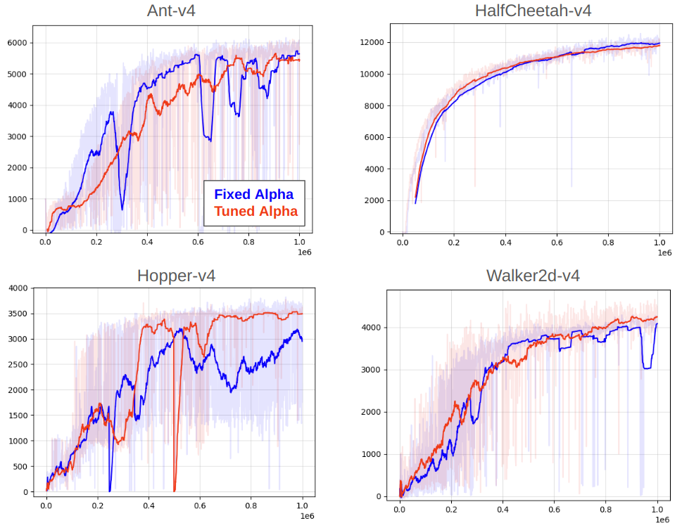

# SAC Base

This is a base version of Soft Actor-Critic that is meant as a starting point for algorithm modifications or as a simple implementation to use in research. It is refactored from spinning-up and includes some additional functionality here and there.

The algorithm is separated into a high-level routine and a low-level worker routine, which enables exploration of parallelization or population-based variants of the algorithm (neither included here).

This work is authored by Ted Staley and is Copyright © 2024 The Johns Hopkins University Applied Physics Laboratory LLC, please see the LICENSE file.


## Installation

Requires torch, tensorboard, numpy, scipy, and gym(nasium). These should be pip installable.

Then, simply clone repo and:

```
pip install -e .
```


## Example Usage

See ```train.py``` in examples/mujoco. In general, you need to define three methods and pass these to sac_base.sac.SAC():

- A method that builds and returns an environment instance, applying all wrappers, etc
- A method that builds and returns a policy network. This should accept a state and have two outputs: the mean and log-standard deviation for a Gaussian action head.
- A method that builds and returns a Q network. This should accept a concatenated state+action and output a single value.

Together these give a great deal of flexibility over the experiment (along with many hyperparameters you can set).


## Changes from Spinning-Up

- Refactored to separate the high-level algorithm (sac.py) from the lower-level details (worker.py). I find this useful if I want to hack at the algorithm. It is also easier to "see" the big picture this way. But there are more files now.
- Can pass in custom networks for policy and value function. These are currently limited to vector-style inputs.
- Added support for tuning alpha instead of using fixed alpha (see comparison of performance below).
- Supports gymansium
- A few minor things: 
  - Logging to tensorboard
  - Model saving triggered by new performance best
  - Estimated FPS and time remaining printouts


## Results on Mujoco Environments

This implementation was applied to four mujoco environments (Ant, HalfCheetah, Hopper, Walker2d) both with and without alpha tuning. No special wrappers were applied to the environments (i.e. observation normalization).

Tuning alpha seems to be a minor improvement in this case, although it may be environment-dependent.

The results are as follows:

